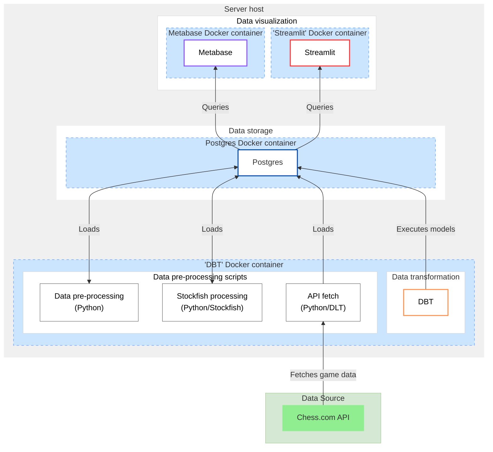

# ♟️ Overview

## Purpose
This project is an end-to-end data solution aiming to extract information from chess.com and construct insightful analysis on the player's performance.
The key questions answered are:
- "Do I manage to beat stronger players and improve ?"
- "Am I weaker at specific game phases on average ?"
- "Do I manage to reduce the frequency at which I make blunders in my games ?"
- "Do I make more or less blunders compared to other similar players ? Is it true for all game phases ?"
- "What are the games I should review to address the most important issues I have ?"
- "Do I make big mistakes when I am under time pressure ?"

Here are some previews of the **Metabase** dashboard:

Here are some previews of the **Streamlit** dashboard (designed specifically for players' benchmarking):

## Repository
This repository contains all the scripts aiming to: 
1. Set up a Postgres database.
2. Extract the games played data from the chess.com API and load it in Postgres.
3. Extract the individual moves for each game played, evaluate the position using the Stockfish engine, and load it in Postgres.
4. Construct a data model using DBT to define metrics and dimensions (blunders, game phases, ELO ranges, etc.).
5. Deploy dashboards via Streamlit and Metabase.

# 🛠️ Technical overview

## Data pipeline and deployment architecture

## Tools
- Data extraction (API): **Python** (with [DLT - Data Load Tool library](https://dlthub.com/docs/dlt-ecosystem/verified-sources/chess))
- Data pre-processing (regex parsing): **Python**
- Chess evaluation: **Stockfish engine** (with Python)
- Data storage & compute: **Postgres**
- Data transformation: **DBT** (on Docker)
- Data visualization: **Metabase & Streamlit** (on Docker)
- Documentation: **DBT Docs**
- Deployment: **from Docker Hub**, with **Docker Compose** including [**Watchtower**](https://github.com/containrrr/watchtower)
- Pipeline monitoring: [**Healthcheck.io**](https://healthchecks.io/)

## Requirements
- Python
- Docker
- Makefile

## Commands
This project is fully dockerized and can be executed locally or deployed on a server.

### Local execution
1. Rename the `.env.example` file to `.env` and update the DB_NAME, DB_USER, DB_PASSWORD with the values of your choice.
2. Using Docker Desktop, run `docker-compose up -d`

You can also choose to install the `requirements.txt` in virtual environment and run the commands against the dockerized Postgres DB:
- `make run_all`: run the continuous pipeline updating all tables. This is the most important command.
- `make run_all_with_reset`: DROP all schemas (except Stockfish processed games) + run the continuous pipeline `run_all` (full refresh).
- `make run_dbt_full_refresh`: run DBT full-refresh once.
- `make run_dbt_test`: run DBT tests once.
- `make run_dbt_compile`: run DBT compile once.
- `make run_dbt_doc`: run DBT docs generate & docs serve once.
- `make test_dbt_doc`: run a Python test to ensure that the documentation is consistent between the DBT YAML files and the `doc.md`file centralizing definitions.

### Server deployment (VPS)
1. Rename the `.env.example` file to `.env` and update the DB_NAME, DB_USER, DB_PASSWORD with the values of your choice.
2. copy the `.env` file to a project repository on your server.
3. copy the `docker-compose.yml` to the same project repository on your server.
4. run the command `docker-compose up -d`.

# 📂 Project

## Data extraction
The script `chess_games_pipeline.py` gets the data from the chess.com API using the DLT library with the `chess` package and loads it into Postgres.
It uses the `config.yml` to define usernames and history depth to be queried, as well as Postgres project information with table names to be used.

### Incremental strategy
The chess.com games information is partitioned by username and month on the API requests. 
Therefore, the `__init__.py` script in the `chess`package has been modified to query only the partitions that are greater than or equal to the latest partitions integrated in Postgres for each username. Before this custom development, the `chess` package only supported full loads or simply did not update the partitions for the current month. 

## Stockfish evaluation
The script `chess_games_moves_pipeline.py` reads the integrated chess.com data and parses the `[pgn]` field to extract the individual game moves and evaluate a score using the Stockfish engine.
It uses the `config.yml` to define the Postgres project information with table names to be used.

### Incremental strategy 
Only games not yet processed are processed by the Stockfish engine. To identify those games, a query is executed in Postgres, comparing the games loaded with the games loaded for which game moves have been already evaluated. This query is templated under the `helper.py` file.

## Python pre-processing
The script `chess_games_times_pipeline.py` reads the integrated chess.com data and parses the `[pgn]` field to extract the individual game clock times using regex.
It uses the `config.yml` to define the Postgres project information with table names to be used. 

### Incremental strategy 
Only games not yet processed are processed. `chess_games_times_pipeline.py` uses the same SQL query `helper.py` to identify games to be processed incrementally.

## DBT

#### Layers
The datawarehouse is structured through several layers in order to ensure (1) performance (2) clarity and (3) modularity:
- **'staging'**: raw data extracted from chess.com and evaluated using the stockfish engine. This layer contains a .csv DBT seed used as a hard coded mapping table for some users owning several accounts. It also contains the results of the `chess_games_times_pipeline.py` script extracting raw clock times.
- **'intermediate'**: cleansed layer on top of the staging layer, aiming to cast data types and derive calculated fields. Tables in the intermediate layer share a 1:1 relationship with tables in the staging layer and preserve the same granularity (i.e. no join or aggregation/duplication is performed). Basic data consistency checks are performed on this layer to catch errors as early as possible.
- **'datawarehouse'**: verified reporting-ready tables used in Metabase/Streamlit. Those models merge intermediate tables together to derive business metrics & dimensions, based on rules and parameters. Those tables are exhaustive as they contain all the necessary information in a denormalized structure (One-Big-Table approach). `dwh_games_with_moves.sql` is the main table containing all the information at the most granular level. Other tables like `dwh_agg_games_with_moves.sql` and `dwh_recent_games_moves.sql` build on top of this table to derive different metrics or definitions at different aggregation levels. Technically, I could have created a dimension model with `fact_games`, `dim_games`, `fact_games_moves`, etc. but this would have resulted in more complexity and joins since metrics are dimensions are deeply intertwined in this project. There are just too few entities to split apart (essentially 3: games, games moves and players).

#### Materialization strategy
As much as possible, models use the incremental DBT materialization strategy. The incremental key is the indexed [uuid] column which represents the game ID. Two alternative candidate keys were considered but ultimately not selected:
- Game end date ([end_time]): using this key would make it impossible to integrate new players with their history without having to perform a full refresh.
- Load date in staging ([log_timestamp]): DLT overwrites the monthly partitions for each player, so this [log_timestamp] would update on every API call, making the pipeline process and overwrite already ingested games data every run. A custom solution could have been developed to modify DLT's default behavior; however, my objective was to leverage the standard, out-of-the-box functionality for data ingestion.

The only table not materialized as incremental is `dwh_agg_games_benchmark.sql` which aggregates the entire history at the player level. Therefore, the DBT materialized_view materialization was used for performance reasons on both the DWH and BI sides.

### Data quality and testing 
DBT tests have been developed to monitor data quality:
- Generic DBT tests 'not_null' or 'unique_combination_of_columns' on key fields.
- Custom DBT tests on the Stockfish games evaluation and clock-time extractions, to ensure that all games are processed as expected and all moves are evaluated.
Those tests are automatically executed via the script `run_all.py` (more information below).

### Documentation
All models are documented in DBT via YAML files. All parameters are centralized under the `dbt_project.yml` file (e.g. describing when each game phase starts, what is the threshold for a small blunder or a massive blunder, etc.). 

Since several models share the same fields, I use a markdown file `doc.md` to centralize new definitions and I call those definitions inside each YAML file. To ensure that there is a perfect match between the `doc.md` and the various YAML files, I created a script `test_doc.py` which can be executed to make a full gap analysis and raise warnings if any.

## Orchestration
The `run_all.py` script is the primary orchestrator for the data pipeline, operating in a continuous loop with a 10-minute delay between each run.
Each cycle performs the following steps:
1. Executes the staging table scripts (API, Stockfish, etc.).
2. Initiates a dbt run command to execute the models.
3. Sends a health check signal (success or failure) to a dedicated endpoint on Healthcheck.io.
4. Additionally, every 100th cycle, the script runs dbt test to perform data quality checks. The result of this test is reported to a separate Healthcheck.io endpoint. A failure in this stage is treated as a "soft fail," meaning it is logged and monitored but does not halt the main pipeline's execution.

## Data visualization
### Metabase
Metabase is used to construct the dashboards and analysis. I hosted Metabase in a VPS, on Hetzner, using the public Metabase docker image.

The folder `metabase.db` is a backup of all the Metabase developments, and it can be used if any re-deployment is needed. In such a scenario, we should simply replace the existing folder `metabase.db` inside the Docker container with the backup.

### Streamlit
As explained, Streamlit was also deployed to complement Metabase's limits and solve more advanced analytical use cases. To avoid having 2 separate data visualization tools, we could imagine to migrate the most insightful Metabase graphs to Streamlit.

Pytests (under `test_data_processing.py`) were added to the project, mostly to verify that the data transformation functions were working as expected.

It is also important to note that the Streamlit application has a dependency with DBT as it uses the `dbt_project.yml` file to show the metrics definitions and business rules dynamically. We can actually see those definitions under the `config.py`.

# ⏳ Project history
This project is a refactoring of an original GitHub project called [chess_com_bi](https://github.com/gabriellegall/chess_com_bi) developed on BigQuery and orchestrated using GitHub Runners. 

Here are the main changes:
- **Improved the frequency at which the database can be queried**:
    - **Problem:** Frequent queries on BigQuery lead to higher costs, as billing is based on bytes scanned. This required to pre-aggregate most of the final tables before displaying them on Metabase in real-time (as of August 2025, [Metabase does not support persistent models for BigQuery](https://www.metabase.com/docs/latest/data-modeling/model-persistence)).
    - **Solution:** Migrating to a Postgres database hosted on a VPS eliminates query costs and reduces latency by centralizing application components on a single server, thereby improving query performance.

- **Improved data freshness**:
    - **Problem:** Users expect live data in their dashboard (playing a game and then directly checking the results). BigQuery and GitHub Actions are fit for daily batch processing; however, for near real-time data integration (every 10-15 minutes), the free tiers quickly become a bottleneck.
    - **Solution:** Using Postgres and a continuously running integration script, we can essentially construct a near real-time BI solution. API calls, Stockfish processing and DBT jobs now execute incrementally every 10 min.

- **Extended analytics**:
    - **Problem:** Metabase is efficient for quick visualization, but less suitable for advanced analytics. For instance, it does not support basic box plots, which are essential to benchmark players' performance.
    - **Solution:** A Streamlit application was developed to complement Metabase and produce insightful benchmarks. 

- **Simplified data ingestion with DLT**:
    - **Problem:** In the original project, [the code](https://github.com/gabriellegall/chess_com_bi/blob/main/scripts/bq_load_player_games.py) to ingest data from chess.com was custom and did not leverage existing tools like the Python library Data Load Tool (DLT) which has native connectors to chess.com.
    - **Solution:** Leveraging DLT significantly simplified the data ingestion pipeline from chess.com, enhancing code maintenance and readability. While some customization was necessary to implement incremental integration within DLT’s `chess` package, the overall ingestion code is considerably simpler.

- **Use of Python for data pre-processing**:
    - **Problem:** Unlike BigQuery, Postgres lacks simple native support for complex analytical transformations, such as regex-based array generation.
    - **Solution:** Due to Postgres’ complexity and performance limits, Python was employed for preprocessing tasks such as extracting timestamps from text. [This used to be a BigQuery SQL DBT model in the original project](https://github.com/gabriellegall/chess_com_bi/blob/main/models/intermediate/games_times.sql).

# ⚙️ CI/CD
The GitHub workflow `dbt_dockerhub_update` runs everytime there is a push on the main branch and updates the Docker images on DockerHub. Then, Watchtower updates the running containers directly in the VPS. 

# 🚀 Outlook

## Possible improvements

### Data analytics
- Migration of the Metabase questions to Streamlit (to centralize everything under a single solution).
- Integration of more metrics in the benchmark (like % of time remaining on the 1st massive blunder, etc.)
- Analysis on the performance by opening (win rate by opening, breakdown by opponent vs playing user opening, etc.)

### Code
- the Python scripts integrating data in the staging layer could be complemented with more unit tests, using pytest.

### Packages
- Although the project is very small, it could have been beneficial to use [dbt_project_evaluator](https://hub.getdbt.com/dbt-labs/dbt_project_evaluator/latest/) to monitor the usage of DBT's best practices.
