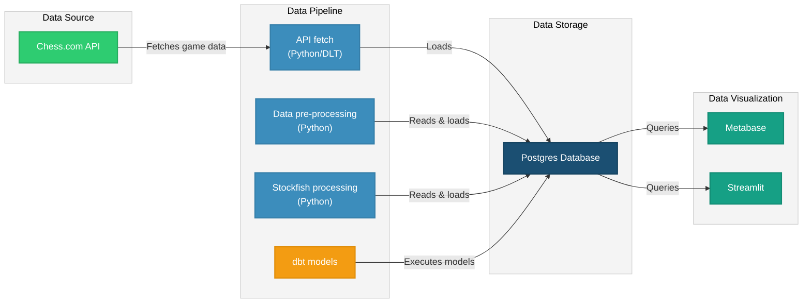

# ♟️ Overview

## Purpose
This project is an end-to-end data solution aiming to extract information from chess.com and construct insightful analysis on the player's performance.
The key questions answered are:
- "Do I manage to beat stronger players and improve ?"
- "Am I weaker at specific game phases on average ?"
- "Do I manage to reduce the frequency at which I make blunders in my games ?"
- "Do I make more or less blunders compared to other similar players ? Is it true for all game phases ?"
- "What are the games I should review to address the most important issues I have ?"
- "Do I make big mistakes when I am under time pressure ?"

Here are some previews of the **Streamlit** dashboard:

## Repository
This repository contains all the scripts aiming to: 
1. Set up a Postgres database.
2. Extract the games played data from the chess.com API and load it in Postgres.
3. Extract the individual moves and clock-times for each game played, evaluate the position using the Stockfish engine, and load it in Postgres.
4. Extract the chess openings database from Hugging Face and load it in Postgres. 
5. Construct a full data model using dbt to validate and transform data - defining metrics and dimensions (blunders, game phases, ELO ranges, etc.).
6. Deploy dashboards via Streamlit and Metabase.

# 🛠️ Technical overview

## Data pipeline and deployment architecture

```mermaid
graph LR;

    %% Data Source
    subgraph DS ["Data Source"]
        A[Chess.com API]
    end

    %% Processing
    subgraph Processing ["Data Pipeline"]
        B["API fetch<br>(Python/DLT)"]
        n1["Data pre-processing<br>(Python)"]
        n2["Stockfish processing<br>(Python)"]
        D["dbt models"]
    end

    %% Storage
    subgraph Storage ["Data Storage"]
        C[Postgres Database]
    end

    %% Visualization
    subgraph Viz ["Data Visualization"]
        E["Metabase"]
        F["Streamlit"]
    end

    %% Data flow
    A -->|"Fetches game data"| B
    B -->|"Loads"| C
    n1 -->|"Reads & loads"| C
    n2 -->|"Reads & loads"| C
    D -->|"Executes models"| C
    C -->|"Queries"| E
    C -->|"Queries"| F

    %% Subgraph styling (light, semi-transparent)
    style DS fill:#f4f4f4,stroke:#ccc,stroke-width:1px,color:#000
    style Processing fill:#f4f4f4,stroke:#ccc,stroke-width:1px,color:#000
    style Storage fill:#f4f4f4,stroke:#ccc,stroke-width:1px,color:#000
    style Viz fill:#f4f4f4,stroke:#ccc,stroke-width:1px,color:#000

    %% Node styling
    style A fill:#2ecc71,stroke:#27ae60,stroke-width:2px,color:white
    style B fill:#3c8dbc,stroke:#367fa9,stroke-width:2px,color:white
    style n1 fill:#3c8dbc,stroke:#367fa9,stroke-width:2px,color:white
    style n2 fill:#3c8dbc,stroke:#367fa9,stroke-width:2px,color:white
    style D fill:#f39c12,stroke:#e08e0b,stroke-width:2px,color:white
    style C fill:#1B4F72,stroke:#154360,stroke-width:2px,color:white
    style E fill:#16a085,stroke:#138d75,stroke-width:2px,color:white
    style F fill:#16a085,stroke:#138d75,stroke-width:2px,color:white
```

## Tools
- Data extraction (API): **Python** (with [DLT - Data Load Tool library](https://dlthub.com/docs/dlt-ecosystem/verified-sources/chess))
- Data pre-processing (regex parsing, ches openings ingestion): **Python**
- Chess evaluation: **Stockfish engine** (with Python)
- Data storage & compute: **Postgres**
- Data transformation: **dbt** (on Docker)
- Data visualization: **Streamlit** (on Docker)
- Documentation: **dbt Docs**
- Deployment: **from Docker Hub**, with **Docker Compose** including [**Watchtower**](https://github.com/containrrr/watchtower)
- Pipeline monitoring: [**Healthcheck.io**](https://healthchecks.io/)

## Requirements
- Python
- Docker
- Makefile

## Commands
This project is fully dockerized and can be executed locally or deployed on a server.

### Local execution
1. Rename the `.env.example` file to `.env` and update the DB_NAME, DB_USER, DB_PASSWORD with the values of your choice.
2. Using Docker Desktop, run `docker-compose up -d`

You can also choose to install the `requirements.txt` in virtual environment and run the commands against the dockerized Postgres DB:
- `make run_all`: run the continuous pipeline updating all tables. This is the most important command.
- `make run_all_with_reset`: DROP all schemas (except Stockfish processed games) + run the continuous pipeline `run_all` (full refresh).
- `make test_dbt_doc`: run a Python test to ensure that the documentation is consistent between the dbt YAML files and the `doc.md` file centralizing definitions.
- `make sqlfluff_fix`: run sqlfluff to verify (and fix) all dbt models and ensure that the SQL complies with the enforced rules.

### Server deployment (VPS)
1. Rename the `.env.example` file to `.env` and update the DB_NAME, DB_USER, DB_PASSWORD with the values of your choice.
2. copy the `.env` file to a project repository on your server.
3. copy the `docker-compose.yml` to the same project repository on your server.
4. run the command `docker-compose up -d`. This will start all applications and execute `run_all.py`.

# 📂 Project

## Data extraction
The script `chess_games_pipeline.py` gets the data from the chess.com API using the DLT library with the `chess` package and loads it into Postgres.
It uses the `config.yml` to define usernames and history depth to be queried, as well as Postgres project information with table names to be used.

### Incremental strategy
The chess.com games data is partitioned by username and month on the API requests. 
Therefore, the `__init__.py` script in the `chess` package has been modified to query only the partitions that are greater than or equal to the latest partitions integrated in Postgres for each username. Before this custom development, the `chess` package only supported full loads or simply did not update the partitions for the current month. 

## Stockfish evaluation
The script `chess_games_moves_pipeline.py` reads the integrated chess.com data and parses the `[pgn]` field to extract the individual game moves and evaluate a score using the Stockfish engine.
It uses the `config.yml` to define the Postgres project information with table names to be used and the index to be created.

### Incremental strategy 
Only games not yet processed are processed by the Stockfish engine. To identify those games, a query is executed in Postgres, comparing the games loaded with the games loaded for which game moves have been already evaluated. This query is templated under the `helper.py` file.

## Python pre-processing
The script `chess_games_times_pipeline.py` reads the integrated chess.com data and parses the `[pgn]` field to extract the individual game clock times using regex.
It uses the `config.yml` to define the Postgres project information with table names to be used and the index to be created. 

### Incremental strategy 
Only games not yet processed are processed. `chess_games_times_pipeline.py` uses the same SQL query `helper.py` to identify games to be processed incrementally.

## Chess openings
The script `chess_openings_pipeline.py` reads ands loads the database of all chess openings from Hugging Face.
It uses the `config.yml` to define the Postgres project information with table names to be used.

### Incremental strategy
The pipeline `chess_openings_pipeline.py` is only executed once in the script `run_all.py`. 
Indeed, this data source is mostly static and does not need to be updated frequently.

## dbt

### Layers
The datawarehouse is structured through several layers in order to ensure (1) performance (2) clarity and (3) modularity:
- **'raw'**: raw data extracted from chess.com and evaluated using the stockfish engine. This layer contains a .csv dbt seed used as a hard coded mapping table for some users owning several accounts. It also contains the results of the `chess_games_times_pipeline.py` script extracting raw clock times, as well as the openings data from `chess_openings_pipeline.py`.
- **'staging'**: virtual layer on top of the raw layer, aiming to cast data types and derive very simple and static calculated fields. Tables in the staging layer share a 1:1 relationship with tables in the raw layer and preserve the same granularity (i.e. no join or aggregation/duplication is performed).
- **'intermediate'**: transformation layer where the business logic is built. It enriches staging data, joins game, move, time and opening datasets together, and creates derived metrics such as move-level chess evaluations, miss classifications, game-phase flags, opening hierarchies and aggregated per-game stats.
- **'marts'**: reporting-ready layer built on top of the intermediate models. The core marts follow a clear `dim` / `fct` split and align with a Kimball-style 2NF design: dimensions store descriptive attributes, facts store measurable events, and each model keeps a clear grain for clarity, consistency and modularity. The `obt_*` analytics model is intentionally kept in 1NF as one wide denormalized table to make querying easier for dashboards and ad hoc analysis. In short, the normalized marts serve modeling needs, while the OBT serves consumption needs.

### Materialization strategy

**Staging (`stg`):** All staging models are materialized as views. Since they are simple 1:1 projections on top of raw tables with no joins or aggregations, views avoid storing redundant data and ensure upstream changes are reflected immediately without a rerun.

**Intermediate (`int`):** Most intermediate models are incremental with append-only inserts. The incremental key varies by data source:
- Models built on chess.com API data filter incrementally on `end_time` (game end datetime). `log_timestamp` cannot be used here because DLT re-fetches the latest monthly archive on every run to catch newly played games, and sets `log_timestamp` at fetch time for all games in that partition — including ones already integrated. Using `log_timestamp` as the incremental key would therefore re-process the entire current month's games on every run, not just the new ones. `end_time` is stable per game and avoids this problem.
- Models built on Python-processed data (Stockfish moves and clock times) filter incrementally on `log_timestamp`, which represents when each batch of games was processed.
- `int_game_moves_enriched` sits at the boundary of both sources. Since it joins API game data with Python-processed moves and times, it uses a `uuid` anti-join (`WHERE NOT EXISTS`) to detect and insert only games not yet present in the model. The model sets `run_timestamp = CURRENT_TIMESTAMP` at insert time instead of reusing source timestamps. Downstream models increment on `run_timestamp`, which reflects dbt run time (not Python processing time).
- `int_openings_hierarchy` is materialized as a plain `table` but uses a custom self-select pattern: on regular runs it simply returns `SELECT * FROM {{ this }}`, skipping recomputation entirely. A full rebuild only happens on `--full-refresh`, which is acceptable since the underlying openings data is mostly static.

**Marts (`core` and `analytics`):** Mart models follow the same incremental key as their upstream intermediate source — `end_time` for API-sourced game models, `log_timestamp` for Python-processed models, and `run_timestamp` for models derived from `int_game_moves_enriched` (`fct_game_moves`, `fct_games_stats`, `dim_games_openings`, `obt_games_stats_filtered`). All incremental models are backed by a Postgres index on their respective incremental key.

#### Design trade-offs

The main downside of using `end_time` as the incremental key is that onboarding a new player with a historical backlog requires a full refresh to backfill old games.

To avoid that, I previously tested a fully UUID-driven approach applying `WHERE NOT EXISTS` across all models. It worked correctly but did not scale well: anti-join subqueries became increasingly expensive as table sizes grew, making it impractical on large models.

### Data quality and testing 
dbt tests have been developed to monitor data quality:
- Generic dbt tests 'not_null' or 'unique_combination_of_columns' on key fields.
- Custom dbt tests on the Stockfish games evaluation and clock-time extractions, to ensure that all games are processed as expected and all moves are evaluated.
Those tests are automatically executed via the script `run_all.py` (more information below).

### Documentation
All models are documented in dbt via YAML files. All parameters are centralized under the `dbt_project.yml` file (e.g. describing when each game phase starts, what is the threshold for a small blunder or a massive blunder, etc.). 

Since several models share the same fields, I use a markdown file `doc.md` to centralize new definitions and I call those definitions inside each YAML file. To ensure that there is a perfect match between the `doc.md` and the various YAML files, I created a script `test_doc.py` which can be executed to make a full gap analysis and raise warnings if any.

## Orchestration
The `run_all.py` script is the primary orchestrator for the data pipeline, operating in a continuous loop with a 10-minute delay between each run.
Each cycle performs the following steps:
1. Executes the staging table scripts (API, Stockfish, etc.).
2. Initiates a dbt run command to execute the models.
3. Sends a health check signal (success or failure) to a dedicated endpoint on Healthcheck.io.
4. Additionally, every 100th cycle, the script runs dbt test to perform data quality checks. The result of this test is reported to a separate Healthcheck.io endpoint. A failure in this stage is treated as a "soft fail," meaning it is logged and monitored but does not halt the main pipeline's execution.

## Data visualization
### Metabase
Metabase is used to construct the dashboards and analysis. I hosted Metabase in a VPS, on Hetzner, using the public Metabase docker image.

### Streamlit
As explained, Streamlit was also deployed to complement Metabase's limits and solve more advanced analytical use cases. To avoid having 2 separate data visualization tools, we could imagine to migrate the most insightful Metabase graphs to Streamlit.

Pytests (under `test_data_processing.py`) were added to the project, mostly to verify that the data transformation functions were working as expected.

It is also important to note that the Streamlit application has a dependency with dbt as it uses the `dbt_project.yml` file to show the metrics definitions and business rules dynamically. We can actually see those definitions under the `config.py`.

# ⚙️ CI/CD
The GitHub workflow `dbt_dockerhub_update` runs everytime there is a push on the main branch and updates the Docker images on DockerHub. Then, Watchtower updates the running containers directly in the VPS. 

# ⏳ Project history
This project is a refactoring of an original GitHub project called [chess_com_bi](https://github.com/gabriellegall/chess_com_bi) developed on BigQuery and orchestrated using GitHub Runners. 

Here are the main changes:
- **Improved the frequency at which the database can be queried**:
    - **Problem:** Frequent queries on BigQuery lead to higher costs, as billing is based on bytes scanned. This required to pre-aggregate most of the final tables before displaying them on Metabase in real-time (as of August 2025, [Metabase does not support persistent models for BigQuery](https://www.metabase.com/docs/latest/data-modeling/model-persistence)).
    - **Solution:** Migrating to a Postgres database hosted on a VPS eliminates query costs and reduces latency by centralizing application components on a single server, thereby improving query performance.

- **Improved data freshness**:
    - **Problem:** Users expect live data in their dashboard (playing a game and then directly checking the results). BigQuery and GitHub Actions are fit for daily batch processing; however, for near real-time data integration (every 10-15 minutes), the free tiers quickly become a bottleneck.
    - **Solution:** Using Postgres and a continuously running integration script, we can essentially construct a near real-time BI solution. API calls, Stockfish processing and dbt jobs now execute incrementally every 10 min.

- **Extended analytics**:
    - **Problem:** Metabase is efficient for quick visualization, but less suitable for advanced analytics. For instance, it does not support basic box plots, which are essential to benchmark players' performance.
    - **Solution:** A Streamlit application was developed to complement Metabase and produce insightful benchmarks. 

- **Simplified data ingestion with DLT**:
    - **Problem:** In the original project, [the code](https://github.com/gabriellegall/chess_com_bi/blob/main/scripts/bq_load_player_games.py) to ingest data from chess.com was custom and did not leverage existing tools like the Python library Data Load Tool (DLT) which has native connectors to chess.com.
    - **Solution:** Leveraging DLT significantly simplified the data ingestion pipeline from chess.com, enhancing code maintenance and readability. While some customization was necessary to implement incremental integration within DLT’s `chess` package, the overall ingestion code is considerably simpler.

- **Use of Python for data pre-processing**:
    - **Problem:** Unlike BigQuery, Postgres lacks simple native support for complex analytical transformations, such as regex-based array generation.
    - **Solution:** Due to Postgres’ complexity and performance limits, Python was employed for preprocessing tasks such as extracting timestamps from text. [This used to be a BigQuery SQL dbt model in the original project](https://github.com/gabriellegall/chess_com_bi/blob/main/models/intermediate/games_times.sql).

# 🚀 Outlook

## Possible improvements

### Data analytics
- Migration of the Metabase questions to Streamlit (to centralize everything under a single solution).
- Integration of more metrics in the benchmark (like % of time remaining on the 1st massive blunder, etc.)
- Analysis on the performance by opening (win rate by opening, breakdown by opponent vs playing user opening, etc.)

### Code
- the Python scripts integrating data in the staging layer could be complemented with more unit tests, using pytest.

### Packages
- Although the project is very small, it could have been beneficial to use [dbt_project_evaluator](https://hub.getdbt.com/dbt-labs/dbt_project_evaluator/latest/) to monitor the usage of dbt's best practices.
