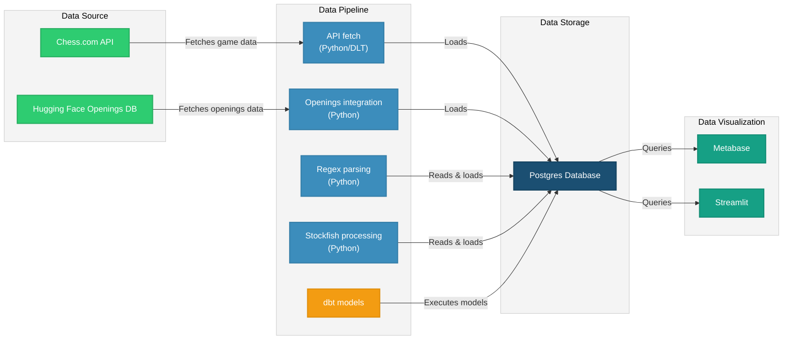

# ♟️ Overview

## Purpose
This project is an end-to-end data solution aiming to extract information from chess.com and construct insightful analysis on the player's performance.
The key questions answered are:
- "Do I manage to beat stronger players and improve?"
- "Am I weaker at specific game phases on average ?"
- "Do I manage to reduce the frequency at which I make blunders in my games ?"
- "Do I make more or less blunders compared to other similar players ? Is it true for all game phases ?"
- "What are the games I should review to address the most important issues I have ?"
- "Do I make big mistakes when I am under time pressure ?"

Here are some previews of the **Streamlit** dashboard:


## Repository
This repository contains all the scripts aiming to: 
1. Set up a Postgres database.
2. Extract the games played data from the chess.com API and load it in Postgres.
3. Extract the individual moves and clock-times for each game played, evaluate the position using the Stockfish engine, and load it in Postgres.
4. Extract the [chess openings database from Hugging Face](https://huggingface.co/datasets/Lichess/chess-openings) and load it in Postgres. 
5. Construct a full data model using dbt to validate and transform data - defining metrics and dimensions (blunders, game phases, ELO ranges, etc.).
6. Deploy a Streamlit dashboard containing the key analytical visualizations.
7. Deploy a Metabase instance for self-service analytics (if ever needed).

# 🛠️ Technical overview

## Data pipeline and deployment architecture

```mermaid
graph LR;

    %% Data Source
    subgraph DS ["Data Source"]
        A[Chess.com API]
        G[Hugging Face Openings DB]
    end

    %% Processing
    subgraph Processing ["Data Pipeline"]
        B["API fetch<br>(Python/DLT)"]
        n1["Openings integration<br>(Python)"]
        n3["Regex parsing<br>(Python)"]
        n2["Stockfish processing<br>(Python)"]
        D["dbt models"]
    end

    %% Storage
    subgraph Storage ["Data Storage"]
        C[Postgres Database]
    end

    %% Visualization
    subgraph Viz ["Data Visualization"]
        E["Metabase"]
        F["Streamlit"]
    end

    %% Data flow
    A -->|"Fetches game data"| B
    G -->|"Fetches openings data"| n1
    B -->|"Loads"| C
    n1 -->|"Loads"| C
    n3 -->|"Reads & loads"| C
    n2 -->|"Reads & loads"| C
    D -->|"Executes models"| C
    C -->|"Queries"| E
    C -->|"Queries"| F

    %% Subgraph styling (light, semi-transparent)
    style DS fill:#f4f4f4,stroke:#ccc,stroke-width:1px,color:#000
    style Processing fill:#f4f4f4,stroke:#ccc,stroke-width:1px,color:#000
    style Storage fill:#f4f4f4,stroke:#ccc,stroke-width:1px,color:#000
    style Viz fill:#f4f4f4,stroke:#ccc,stroke-width:1px,color:#000

    %% Node styling
    style A fill:#2ecc71,stroke:#27ae60,stroke-width:2px,color:white
    style G fill:#2ecc71,stroke:#27ae60,stroke-width:2px,color:white
    style B fill:#3c8dbc,stroke:#367fa9,stroke-width:2px,color:white
    style n1 fill:#3c8dbc,stroke:#367fa9,stroke-width:2px,color:white
    style n3 fill:#3c8dbc,stroke:#367fa9,stroke-width:2px,color:white
    style n2 fill:#3c8dbc,stroke:#367fa9,stroke-width:2px,color:white
    style D fill:#f39c12,stroke:#e08e0b,stroke-width:2px,color:white
    style C fill:#1B4F72,stroke:#154360,stroke-width:2px,color:white
    style E fill:#16a085,stroke:#138d75,stroke-width:2px,color:white
    style F fill:#16a085,stroke:#138d75,stroke-width:2px,color:white
```

## Tools
- Data extraction (API): **Python** (with [DLT - Data Load Tool library](https://dlthub.com/docs/dlt-ecosystem/verified-sources/chess))
- Data pre-processing (regex parsing, chess openings ingestion): **Python**
- Chess evaluation: **Stockfish engine** (with Python)
- Data storage & compute: **Postgres**
- Data transformation: **dbt** (on Docker)
- Data visualization: **Streamlit** (on Docker)
- Documentation: **dbt Docs**
- Deployment: **from Docker Hub**, with **Docker Compose** including [**Watchtower**](https://github.com/containrrr/watchtower)
- Pipeline monitoring: [**Healthcheck.io**](https://healthchecks.io/)

## Requirements
- [uv](https://docs.astral.sh/uv/)
- Docker
- Makefile

## Commands
This project is fully dockerized and can be executed locally or deployed on a server.

### Local execution

#### Dockerized (recommended)
1. Rename the `.env.example` file to `.env` and update the DB_NAME, DB_USER, DB_PASSWORD with the values of your choice.
2. Using Docker Desktop, run `docker-compose up -d`

#### Non-Dockerized Python execution
You can also run the pipeline commands directly against the dockerized Postgres DB using a local virtual environment managed by `uv`.

Environment setup:
1. Install `uv` (Windows + Chocolatey): `choco install uv -y`
2. Install Python 3.13 through `uv`: `uv python install 3.13`
3. Create a virtual environment in the project root: `uv venv --python 3.13 .venv`
4. Activate it (PowerShell): `.\\.venv\\Scripts\\Activate.ps1`
5. Install dependencies: `uv pip install --python .\\.venv\\Scripts\\python.exe -r .\\dbt\\requirements.txt`

Additional prerequisites:
- Install [Stockfish](https://stockfishchess.org/download/) and make it available in PATH (e.g. `choco install stockfish -y` on Windows), or set the [`STOCKFISH_PATH`] environment variable to the executable path.
- Run `dbt deps` inside the `dbt/` folder.

Pipeline commands:
- `make run_all`: run the continuous pipeline updating all tables. This is the most important command.
- `make run_all_with_reset`: DROP all schemas (except Stockfish processed games) + run the continuous pipeline `run_all` (full refresh).

Data quality commands:
- `make test_dbt_doc`: run a Python test to ensure that the documentation is consistent between the dbt YAML files and the `doc.md` file centralizing definitions.
- `make sqlfluff_fix`: run sqlfluff to verify (and fix) all dbt models and ensure that the SQL complies with the enforced rules.

### Server deployment (VPS)
1. Rename the `.env.example` file to `.env` and update the DB_NAME, DB_USER, DB_PASSWORD with the values of your choice.
2. copy the `.env` file to a project repository on your server.
3. copy the `docker-compose.yml` to the same project repository on your server.
4. run the command `docker-compose up -d`. This will start all applications and execute `run_all.py`.

# 📂 Project

## Data extraction
The script `chess_games_pipeline.py` gets the data from the chess.com API using the DLT library with the `chess` package and loads it into Postgres.
It uses the `config.yml` to define usernames and history depth to be queried, as well as Postgres project information with table names to be used.

### Incremental strategy
The chess.com games data is partitioned by username and month on the API requests. 
Therefore, the `__init__.py` script in the `chess` package has been modified to query only the partitions that are greater than or equal to the latest partitions integrated in Postgres for each username. Before this custom development, the `chess` package only supported full loads or simply did not update the partitions for the current month. 

## Stockfish evaluation
The script `chess_games_moves_pipeline.py` reads the integrated chess.com data and parses the `[pgn]` field to extract the individual game moves and evaluate a score using the Stockfish engine.
It uses the `config.yml` to define the Postgres project information with table names to be used and the index to be created.

### Incremental strategy 
Only games not yet processed are processed by the Stockfish engine. To identify those games, a query is executed in Postgres, comparing the games loaded with the games loaded for which game moves have been already evaluated. This query is templated under the `helper.py` file.

## Python pre-processing
The script `chess_games_times_pipeline.py` reads the integrated chess.com data and parses the `[pgn]` field to extract the individual game clock times using regex.
It uses the `config.yml` to define the Postgres project information with table names to be used and the index to be created. 

### Incremental strategy 
Only games not yet processed are processed. `chess_games_times_pipeline.py` uses the same SQL query `helper.py` to identify games to be processed incrementally.

## Chess openings
The script `chess_openings_pipeline.py` reads and loads the [database of all chess openings from Hugging Face](https://huggingface.co/datasets/Lichess/chess-openings).
It uses the `config.yml` to define the Postgres project information with table names to be used.

### Incremental strategy
The pipeline `chess_openings_pipeline.py` is only executed once in the script `run_all.py`. 
Indeed, this data source is mostly static and does not need to be updated frequently.

## dbt


### Layers
The data warehouse is structured through several layers in order to ensure (1) performance, (2) clarity, and (3) modularity:
- **'raw'**: raw data extracted from chess.com and evaluated using the Stockfish engine (`chess_games_moves_pipeline.py`). This layer contains a `.csv` dbt seed used as a hard-coded mapping table for some users owning several accounts. It also contains the results of the `chess_games_times_pipeline.py` script extracting raw clock times, as well as the openings data from `chess_openings_pipeline.py`.
- **'staging'**: virtual layer on top of the raw layer, aiming to cast data types and derive very simple and static calculated fields. Tables in the staging layer share a 1:1 relationship with tables in the raw layer and preserve the same granularity (i.e. no join or aggregation/duplication is performed).
- **'intermediate'**: transformation layer where the business logic is built. It enriches staging data, joins game, move, time and opening datasets together, and creates derived metrics such as move-level chess evaluations, miss classifications, game-phase flags, opening hierarchies and aggregated per-game stats.
- **'marts'**: reporting-ready layer built on top of the intermediate models. The core marts follow a clear `dim` / `fct` split and align with a Kimball-style [2NF design](https://en.wikipedia.org/wiki/Second_normal_form): dimensions store descriptive attributes, facts store measurable events, and each model keeps a clear grain for clarity, consistency and modularity. The `obt_*` analytics model is intentionally kept in [1NF](https://en.wikipedia.org/wiki/First_normal_form) as one wide denormalized table to make querying easier for dashboards and ad hoc analysis. In short, the normalized marts serve modeling needs, while the OBT serves consumption needs.

### Materialization strategy

- **Staging (`stg`):** All staging models are materialized as **views**. Since they are simple 1:1 projections on top of raw tables with no joins or aggregations, views avoid storing redundant data and ensure upstream changes are reflected immediately without a rerun.

- **Intermediate (`int`):** Most intermediate models are **incremental with append-only inserts**. The incremental key varies by data source:
    - Models built on Python-processed data (Stockfish moves and clock times) filter incrementally on [`log_timestamp`], which represents when each batch of games was processed.
    - Models built on chess.com API data filter incrementally on [`end_time`] (game end datetime). [`log_timestamp`] cannot be used here because DLT re-fetches the latest monthly archive on every run to catch newly played games, and sets [`log_timestamp`] at fetch time for all games in that partition — including ones already integrated. Using [`log_timestamp`] as the incremental key would therefore re-process the entire current month's games on every run, not just the new ones. [`end_time`] is stable per game and avoids this problem.
    - `int_game_moves_enriched` sits at the boundary of both sources. Since it joins API game data with Python-processed moves and times, it uses a [`uuid`] anti-join (`WHERE NOT EXISTS`) to detect and insert only games not yet present in the model. The model sets [`run_timestamp`] = `CURRENT_TIMESTAMP` at insert time instead of reusing source timestamps. Downstream models increment on [`run_timestamp`].
    - `int_openings_hierarchy` is materialized as a plain `table` but uses a custom self-select pattern: on regular runs it simply returns `SELECT * FROM {{ this }}`, skipping recomputation entirely. A full rebuild only happens on `--full-refresh`, which is acceptable since the underlying openings data is mostly static.

- **Marts (`core` and `analytics`):** Mart models follow the same incremental key as their upstream intermediate source — [`end_time`] for API-sourced game models and [`run_timestamp`] for models derived from `int_game_moves_enriched`. All incremental models are backed by a Postgres index on their respective incremental key.

#### Design trade-offs

Using [`end_time`] as the incremental key for chess.com API data scales well for continuous incremental runs, but it has one limitation: when a new player is added with a historical backlog, older games require a full refresh to be backfilled.

For that reason, a periodic full refresh is intentionally kept in orchestration. It also serves as a safety net to:
- Limit any data drift risk in long-running incremental pipelines.
- Automatically re-sync full history after business-rule or metric-definition updates.
- Automatically backfill historical games when new players are added.
- Rebuild `int_openings_hierarchy` (which intentionally skips recomputation on regular runs for efficiency).

I also tested a fully UUID-driven strategy using `WHERE NOT EXISTS` across all models to avoid periodic full refreshes. While functionally correct, it did not scale well: anti-join subqueries became increasingly expensive as tables grew, making this approach impractical on large models.

### Data quality and testing 
dbt tests have been developed to monitor data quality:
- Generic tests on key fields in staging, intermediate, and marts layers include `not_null` and `unique`.
- `dbt_utils.unique_combination_of_columns` is used to validate composite primary keys.
- `relationships` is used in the marts layer to ensure relational integrity.
- dbt_expectations comparison test `expect_table_row_count_to_equal_other_table` is used to validate reliable incremental loads by ensuring row counts are preserved across models and layers.
- Custom dbt tests on Stockfish and clock-time processing:
    - `assert_move_number_consistency.sql`: validates consistency between move counts extracted from clock-time parsing and Stockfish move extraction.
    - `assert_stockfish_processing.sql`: validates that PGN-derived expected moves match evaluated moves loaded by the Stockfish pipeline.
All tests are automatically executed via the script `run_all.py` (more information below).

### Documentation
All models are documented in dbt via YAML files. All parameters are centralized under the `dbt_project.yml` file (e.g. describing when each game phase starts, what is the threshold for a small blunder or a massive blunder, etc.). 

Since several models share the same fields, I use a markdown file `doc.md` to centralize new definitions and I call those definitions inside each YAML file. To ensure that there is a perfect match between the `doc.md` and the various YAML files, I created a script `test_doc.py` which can be executed to make a full gap analysis and raise warnings if any.

The shared game-filter SQL used by both Python (`helper.py`) and dbt (`stg_chess_com__players_games.sql`) is centralized in `dbt_project.yml` under [`processable_games_condition`]. This SQL snippet assumes the source table alias is always `game`.

## Orchestration
The `run_all.py` script is the primary orchestrator for the data pipeline.

It first executes `chess_openings_pipeline.py` once, then enters a continuous loop with a configurable delay between runs.

Each loop performs the following steps:
1. Executes `chess_games_pipeline.py`.
2. Executes `chess_games_times_pipeline.py` and `chess_games_moves_pipeline.py`.
3. Runs dbt transformation steps with `dbt seed`, then:
    - `dbt build --full-refresh --exclude dbt_project_evaluator` once per calendar day.
    - `dbt build --exclude dbt_project_evaluator` on all other loop iterations.
   See dbt > Materialization strategy > Design trade-offs for the rationale.
4. Sends a success healthcheck ping to the main Healthcheck.io endpoint.
5. Every 100th loop, runs `dbt test --exclude dbt_project_evaluator` and reports the result to a dedicated dbt-test Healthcheck.io endpoint. If a dbt-test run fails on the 100th loop, it is treated as a soft fail and the main loop continues.

If any pipeline/build step raises an exception, the script sends a failure ping to the main healthcheck endpoint and exits.

## Data visualization
### Streamlit
Streamlit is the main data visualization tool used in this project.

I chose Streamlit because it is the most flexible free tool I found for building advanced, custom visualizations.
While I would have preferred to use Tableau for this highly analytical use case, Tableau Public does not allow free connectivity to a database.

It is also important to note that the Streamlit application has a dependency on dbt, since it uses the `dbt_project.yml` file to display metrics definitions and business rules dynamically. Those definitions are exposed in `config.py`.

### Metabase
If needed a Metabase app is also made available in `docker-compose.yml` for self-service analytics.

# ⚙️ CI/CD
The GitHub workflow `dbt_dockerhub_update` runs every time there is a push on the main branch and updates the Docker images on DockerHub. Then, Watchtower updates the running containers directly in the VPS.

# ⏳ Project history
This project is a refactoring of an original GitHub project called [chess_com_bi](https://github.com/gabriellegall/chess_com_bi) developed on BigQuery and orchestrated using GitHub Runners. 

Here are the main changes:
- **Improved the frequency at which the database can be queried**:
    - **Problem:** Frequent queries on BigQuery lead to higher costs, as billing is based on bytes scanned. This required to pre-aggregate most of the final tables before displaying them on Metabase in real-time (as of August 2025, [Metabase does not support persistent models for BigQuery](https://www.metabase.com/docs/latest/data-modeling/model-persistence)).
    - **Solution:** Migrating to a Postgres database hosted on a VPS eliminates query costs and reduces latency by centralizing application components on a single server, thereby improving query performance.

- **Improved data freshness**:
    - **Problem:** Users expect live data in their dashboard (playing a game and then directly checking the results). BigQuery and GitHub Actions are fit for daily batch processing; however, for near real-time data integration (every 10-15 minutes), the free tiers quickly become a bottleneck.
    - **Solution:** Using Postgres and a continuously running integration script, we can essentially construct a near real-time BI solution. API calls, Stockfish processing and dbt jobs now execute incrementally and frequently.

- **Extended analytics**:
    - **Problem:** Metabase is efficient for quick visualization, but less suitable for advanced analytics. For instance, as of March 2025, it does not support basic box plots, which are essential to benchmark players' performance.
    - **Solution:** Using Streamlit instead of Metabase enabled more advanced visualizations (e.g. sunburst charts for opening analysis) at the cost of some extra development effort.

- **Simplified data ingestion with DLT**:
    - **Problem:** In the original project, [the code](https://github.com/gabriellegall/chess_com_bi/blob/main/scripts/bq_load_player_games.py) to ingest data from chess.com was custom and did not leverage existing tools like the Python library Data Load Tool (DLT), which has native connectors to chess.com.
    - **Solution:** Leveraging DLT significantly simplified the data ingestion pipeline from chess.com, enhancing code maintenance and readability. While some customization was necessary to implement incremental integration within DLT’s `chess` package, the overall ingestion code is considerably simpler.

- **Adopted a classic dbt layer design**:
    - **Problem:** The previous layering was well suited to BigQuery cost optimization, but less suited to real-time analytics, modularity and scalability on Postgres.
    - **Solution:** I introduced the classic `stg` / `int` / `marts` structure recommended by dbt Labs, with standard naming conventions (`stg_*`, `int_*`, `dim_*`, `fct_*`).

- **Added automated dbt quality guardrails**:
    - **Problem:** As the project grows, keeping model quality consistent becomes harder without automated checks.
    - **Solution:** I integrated `dbt_project_evaluator` to continuously enforce dbt best practices across structure, DAG design, governance, performance, testing, and documentation.

# ✅ Best practices implemented
This section summarizes the dbt best practices that are implemented in this project.

- Staging practices:
    - Staging model naming follows `stg_[source]__[entity]` patterns.
    - Staging models keep a 1:1 source-conformed behavior and preserve source grain.
    - Staging applies basic transformations only: filtering, renaming/derivation, casting, and simple calculated fields.
    - Staging models are materialized as views by default.
    - `source()` macro is used in staging models only.
    - Source definitions are declared and versioned in per-folder source YAML files.
    
    source: [dbt Labs best practices - staging](https://docs.getdbt.com/best-practices/how-we-structure/2-staging?version=1.11)

- Intermediate practices:
    - Intermediate naming consistently uses `int_` prefixes and descriptive verbs when needed (e.g. "filtered", "enriched").
    - Intermediate models are split into functional transformation steps using descriptive CTEs.
    - Intermediate folders are business-domain oriented (`games`, `openings`, `players`).
    - Business transformations are implemented in intermediate models (joins, aggregations, window calculations).
    - DRY via Jinja is actively used inside intermediate models to avoid repetitive SQL blocks.

    source: [dbt Labs best practices - intermediate](https://docs.getdbt.com/best-practices/how-we-structure/3-intermediate?version=1.11)

- Mart practices:
    - Core marts are entity-oriented and modularized into dimensions and facts (`dim_*`, `fct_*`).
    - Building a mart from other marts is used thoughtfully, instead of recomputing everything from upstream logic.
    - Clear model grain is declared and enforced.
    - Marts are materialized as tables/incremental models for query performance.
    - In the absence of a Semantic Layer, wide OBT-style marts are provided and heavily denormalized to optimize for compute and end-user consumption.
    - Surrogate keys are used consistently to stabilize joins.

    sources: 
    - [dbt_project_evaluator naming convention](https://dbt-labs.github.io/dbt-project-evaluator/0.8/rules/structure/#model-naming-conventions)
    - [dbt Labs best practices - marts](https://docs.getdbt.com/best-practices/how-we-structure/4-marts?version=1.11)
    - [dbt Labs surrogate keys](https://www.getdbt.com/blog/guide-to-surrogate-key)

- Folders, YAML, configs, and docs:
    - Layers are structured around clear `staging` / `intermediate` / `marts` folder separation.
    - YAML is organized per folder with leading underscore naming (`_[directory]__models.yml`, `_[directory]__sources.yml`).
    - Config is cascaded through folders in `dbt_project.yml` (schema/materialization defaults).
    - Folder-based structure is used as the primary grouping/selection mechanism (no tag sprawl).
    - Shared field definitions are centralized in `models/doc.md` and reused through `{{ doc('...') }}` references.

    source:
    - [dbt Labs best practices - overview](https://docs.getdbt.com/best-practices/how-we-structure/1-guide-overview?version=1.11)
    - [dbt Labs best practices - other](https://docs.getdbt.com/best-practices/how-we-structure/5-the-rest-of-the-project?version=1.11)
    - [dbt Labs doc.md](https://docs.getdbt.com/reference/dbt-jinja-functions/doc?version=1.11)

- Seeds and tests:
    - Seed files are used for static lookup/mapping data (`username_mapping`).
    - The `tests` folder contains custom singular multi-model assertions.
    - Generic tests are broadly implemented (`not_null`, `unique`, `relationships`).
    - Composite primary key integrity is enforced with `dbt_utils.unique_combination_of_columns`.
    - Cross-model count consistency checks are implemented with `dbt_expectations`.
    
    source:
    - [dbt Labs best practices - other](https://docs.getdbt.com/best-practices/how-we-structure/5-the-rest-of-the-project?version=1.11)
    - [dbt_project_evaluator primary key testing](https://dbt-labs.github.io/dbt-project-evaluator/latest/rules/testing/#missing-primary-key-tests)

- SQL style:
    - SQLFluff is configured and enforced (`dbt/.sqlfluff` + `dbt/.sqlfluffignore`).
    - Trailing commas are used across multi-line `SELECT` lists.
    - Four-space indentation is used consistently in model SQL.
    - Join types are explicit (`LEFT JOIN`, `INNER JOIN`) instead of implicit `JOIN`.
    - In multi-table joins, selected fields are qualified with table aliases to avoid ambiguity.
    - CTEs are split into clear functional steps with descriptive names (`games_scope`, `score_definition`, `agg_definitions`, etc.).
    - ... more best practices are enforced and listed in `dbt/.sqlfluff`. 

    source:
    - [dbt Labs best practices - SQL](https://docs.getdbt.com/best-practices/how-we-style/2-how-we-style-our-sql?version=1.11)

- Governance
    - A broad set of dbt_project_evaluator domains is enabled (structure, performance, DAG, documentation, governance, tests).

    source:
    - [dbt Labs best practices - style guide](https://docs.getdbt.com/best-practices/how-we-style/6-how-we-style-conclusion?version=1.11#dbt-project-evaluator)

# 🚀 Outlook

## Possible improvements

### Data analytics
- the Streamlit app could be enriched with more analysis, focusing on key areas of improvement:
    - The ability to convert opponent's error into a win: ```P(Win|[nb_throw_massive_blunder_opponent] > 0)```, or ```P(Win|[max_score_playing] > X)```.
    - The ability to convert a late-game advantage into a win: ```P(Win|score_playing_late_phase > X)```.
    - The ability to withstand near-equal late-game positions: ```P(Win|score_playing_late_phase BETWEEN 0 AND X)```.

### Code
- the Python scripts integrating data in the raw layer could be complemented with more unit tests, using pytest.
